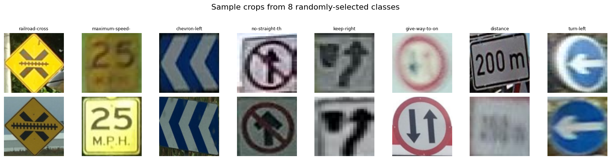
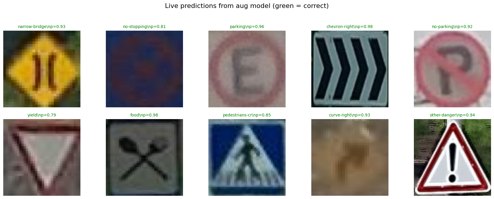

# Traffic Sign Detection

End-to-end traffic-sign classification and deployment project (MTSD experiments, training, evaluation, robustness, and exports).

## Overview

This repository contains code, data splits, experiments, and model exports used in the VisionProject handoff. It includes training scripts, data preparation utilities, evaluation, robustness analysis, and export/deployment helpers.

## Highlights

- Clean experiment scripts and results in `results/`.
- Training and evaluation in `src/` with reusable modules: [src/train.py](src/train.py), [src/evaluate.py](src/evaluate.py).
- Exported model artifacts in `results/export/` and `results/aug/export/` (ONNX, CoreML).
- Notebooks for exploration in `notebooks/`.

## Quickstart

1. Create a Python virtual environment (recommended):

```bash
python3 -m venv .venv
source .venv/bin/activate
pip install --upgrade pip
pip install -r requirements.txt
```

2. Prepare data splits (if needed):

```bash
python src/build_splits.py
```

3. Run a training experiment (example):

```bash
bash run_experiments.sh
# or run directly
python src/train.py --config configs/your_config.yaml
```

4. Evaluate the model:

```bash
python src/evaluate.py --model results/best_model.pt --split test
```

## Repository structure

- `src/` — core code and scripts ([train.py](src/train.py), [evaluate.py](src/evaluate.py), [data.py](src/data.py)).
- `data/` — prepared splits and label map.
- `notebooks/` — analysis and visualizations.
- `results/` — trained weights, history, exported models.
- `models/` — model definitions.

See code files for more details and flags.

## Reproducing experiments

- All experiments use `requirements.txt`. Use the provided `args.json` files in each results folder to reproduce exact training runs.
- Logs and training histories are stored in `results/*/history.json`.

## Deployment

- Simple API and inference utilities available in `src/deploy/` — see [src/deploy/api.py](src/deploy/api.py) and [src/deploy/inference.py](src/deploy/inference.py).

## Contributing

If you'd like to extend experiments or add new datasets, open an issue and include:

1. Short description of the change
2. Expected behaviour and dataset requirements

## License

This project is distributed under the MIT License. See `LICENSE`.

## Contact

Maintainer: project handoff

---

For full details on scripts and options, inspect the `src/` folder and the `run_experiments.sh` script.

## Badges

- 
- 
- 
- 

## Live demo

The project is deployed as a Streamlit demo: https://cnn-predictor.streamlit.app/

## Docker image

The project provides a Docker image on Docker Hub: https://hub.docker.com/r/rashadeltaher/cnn-predictor

Pull and run the image locally:

```bash
docker pull rashadeltaher/cnn-predictor:latest
docker run -p 8501:8501 rashadeltaher/cnn-predictor:latest
```

The `src/deploy/Dockerfile` can be used to build the container locally or in CI.

## Model artifacts

Exported model files are included in the repository at [results/aug/export/model.onnx](results/aug/export/model.onnx) and the CoreML package at [results/aug/export/model.mlpackage](results/aug/export/model.mlpackage).

Direct raw download (GitHub):

https://raw.githubusercontent.com/Rashwan498/traffic-sign-detection/main/results/aug/export/model.onnx

## Results

Key test metrics (from `results/aug/test_metrics.json`):

- **Test samples:** 8604
- **Accuracy:** 96.89%
- **Top-5 accuracy:** 99.51%
- **Macro F1:** 95.82%

Training curve and confusion matrix (click to view):





## CI / Automated Docker build

A GitHub Actions workflow is included to build the Docker image on `push` to `main`. If you add Docker Hub credentials as repository secrets (`DOCKERHUB_USERNAME` and `DOCKERHUB_TOKEN`) the workflow will push the built image to Docker Hub automatically.

To enable pushes from Actions:

1. Go to your repository settings → Secrets → Actions.
2. Add `DOCKERHUB_USERNAME` and `DOCKERHUB_TOKEN` (or a Docker Hub access token).

The workflow file is at `.github/workflows/docker-build.yml`.

## Pinning this repository on your GitHub profile

To highlight this project on your GitHub profile, go to your profile page → "Customize your pins" → select this repository and save.
# Vision Term Project — Traffic Sign Classification on MTSD

End-to-end traffic-sign classification on the Mapillary Traffic Sign Dataset
v2 (MTSD). Classical baseline (HOG → SVM), custom CNN baseline, augmentation
& transfer-learning experiments, robustness evaluation under synthetic
distortions, and deployment as Gradio app + FastAPI/Docker service.

Phases:
- **Phase 1**: Classical pipeline (HOG → SVM). `visionPhase1.ipynb` (original, from colleague).
- **Phase 2** (this work): Custom CNN baseline + augmentation + transfer learning + robustness.
- **Bonus (Option A)**: Deployment (Gradio + FastAPI + Docker + ONNX/CoreML).

## Hardware / framework

- M1 Pro Mac (arm64), PyTorch 2.9 with MPS backend.
- Python 3.12 inside `.venv/` overlay (inherits Anaconda's torch, numpy, sklearn).

## Layout

```
src/
  config.py             central paths, hyperparams, seed
  prepare_data.py       Stage 0 — extract 96x96 crops to HDF5 (resumable)
  build_splits.py       Stage 0b — clean class set + train/val/test splits
  data.py               PyTorch Dataset + DataLoader factory
  models/
    baseline_cnn.py     custom 2.4M-param CNN
  train.py              Stage 1 + 2 training (--augment, --arch flags)
  evaluate.py           metrics + confusion matrix + per-class + curves
  distortions.py        six-axis synthetic distortion suite
  robustness.py         Stage 2 E3 — distortion-vs-severity sweep
  phase1_rerun.py       classical baseline re-evaluated on matched splits
  deploy/
    inference.py        SignClassifier wrapper used by app/api
    app.py              Gradio app (Hugging Face Space)
    api.py              FastAPI service
    export.py           ONNX + CoreML exporter
    Dockerfile          CPU-only FastAPI container
    api_requirements.txt
data/
  crops_cache.h5        190k 96x96 uint8 crops + raw labels + split + image_id
  label_map.json        clean 326-class label map
  splits.json           train/val/test cache-indices + labels
  class_weights.npy     sqrt-inverse-frequency
results/
  <run>/
    history.json        per-epoch metrics
    best.pt, latest.pt  checkpoints (full RNG/optim/sched state)
    args.json           CLI args used for the run
    training_curves.png
    test_metrics.json   final accuracy + macro/weighted P/R/F1
    test_per_class.csv
    test_confusion_matrix.{npy,png}
    robustness.{csv,png}
    export/
      model.onnx, model.mlpackage
```

## Reproduce

```bash
.venv/bin/python -m src.prepare_data
.venv/bin/python -m src.build_splits
.venv/bin/python -m src.train      --name baseline --arch baseline_cnn
.venv/bin/python -m src.train      --name aug      --arch baseline_cnn --augment
.venv/bin/python -m src.train      --name transfer --arch efficientnet_b0 --augment
.venv/bin/python -m src.evaluate   --ckpt results/baseline/best.pt
.venv/bin/python -m src.evaluate   --ckpt results/aug/best.pt
.venv/bin/python -m src.evaluate   --ckpt results/transfer/best.pt
.venv/bin/python -m src.robustness --ckpt results/transfer/best.pt
.venv/bin/python -m src.phase1_rerun --tune
.venv/bin/python -m src.deploy.export --ckpt results/transfer/best.pt
```

## Pause / resume

Every long-running stage is resumable:

| Stage              | Pause                                          | Resume                                           |
|--------------------|------------------------------------------------|--------------------------------------------------|
| crop extraction    | `kill -INT $(cat data/.prep.pid)`              | re-run `python -m src.prepare_data`              |
| training           | `kill -INT $(cat results/.<run>.pid)`          | `python -m src.train --resume results/<run>/latest.pt` |

State is checkpointed at the end of every batch/epoch — at worst you lose
one batch / one in-progress epoch of work.

## Dataset decisions (defended in the paper)

1. **Drop "other-sign"** — 63% of raw crops, by definition unidentified.
2. **Drop classes with <30 train samples** — unlearnable from this little data.
3. **Final class set**: 326 well-supported sign types, 67,833 crops.
4. **Splits**: 90% MTSD-train → our train, 10% MTSD-train → our val,
   100% MTSD-val → our test (held out).
5. **Class weighting**: `sqrt(1/freq)`, mean-normalized to 1.0.
